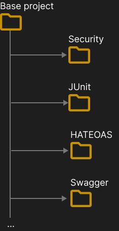

<h1 align="center"><strong>Spring Boot - Exercise Projects</strong></h1>

The purpose of the projects in this repository is to practice developing REST APIs using the Spring Boot framework. The idea is to create an API as a base project, and from it create copy projects where some new functionality is implemented. In this way, each project will have an individual implementation of some functionality, thus making it possible to carry out a more in-depth implementation and subsequently becoming reference material.

&nbsp;

	

&nbsp;

For now, the projects are being developed using Java and Maven. I have plans to develop using Kotlin, Groovy and Gradle, but my main focus is still Java and Maven.

Each project will have its own structure and instructions on how to execute.

This is a personal project, but any contribution or discussion is welcome! 🙂

&nbsp;

<h2>License</h2>

The [MIT License](https://opensource.org/license/isc-license-txt/) (ISC)