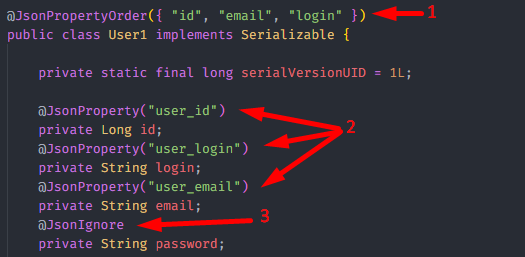
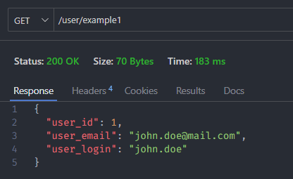
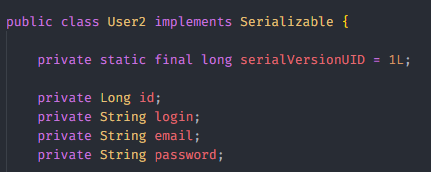
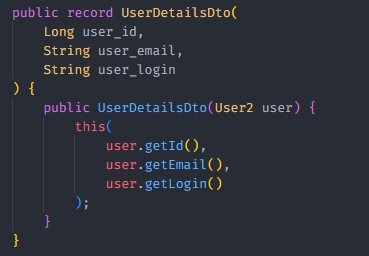
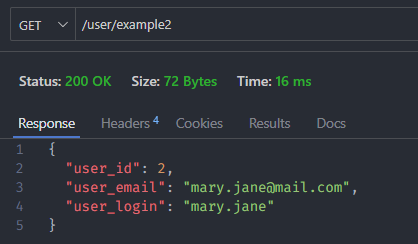

<h1 align="center"><strong>Custom JSON Serialization</strong></h1>

This project is an example of a custom json serialization implementation. The objective is to configure a way to customize the fields in the request response json, changing their order, name and visibility.

Two implementations were used:

<h3><b>1 - Annotations on the response object</b></h3>

This method consists of using @Json annotations from the <i>com.fasterxml.jackson.annotation</i> package in the fields of the User class, which is the object returned in the request response.

In the example below, the following settings were made:

<ol>
	<li>Fields order</li>
	<li>Fields names, from default Camel Case to Snake Case</li>
	<li>Hidden password field</li>
</ol>

	

&nbsp;

This is the json resulting from this configuration:

	

&nbsp;

<h3><b>2 - Using a Data Transfer Object (DTO)</b></h3>

This method consists of using an object that represents the same structure as the User class, but being able to customize how and which data will be displayed. This DTO object will be sent in the response, allowing you to keep the User model class unchanged.

<i>In this example I am using Records from Java 17. However, it is possible to do the same thing with conventional Java classes.</i>

The configuration applied in this example is the same as that applied in the previous example.

	

&nbsp;

	

This is the json resulting from this configuration:

	

&nbsp;

It was possible to obtain the same response json using both configurations.
