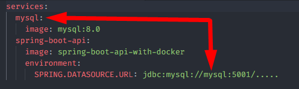
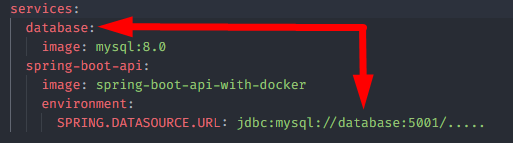

<h1 align="center"><strong>Dockerfile</strong></h1>

This is an example of an API configured to generate an image following instructions defined in the Dockerfile.. This README will detail some points of attention for generating the API image and executing it via Docker containers. For more details, see the [official Spring documentation](https://spring.io/guides/topicals/spring-boot-docker).

&nbsp;

## **JAR file**

For projects using Java and Spring Boot, before starting the image creation stage, it is necessary to generate the application's JAR file.

Check if there is a target folder in the project. This is where maven will create the JAR file. If it already exists, delete the folder and generate it again using the command:

```
mvn clean package
```

The generated file name is composed of:

```
artifactId + version + .jar
```

These values are defined in the project's pom.xml.

&nbsp;

## **Dockerfile**

The Dockerfile is the configuration file for generating the application image. 

You can place this file anywhere in the project. However, to simplify this process, it is suggested to leave this file in the root of the project, next to the pom.xml.

If it is necessary to generate an image of an API using a version equal to or lower than Java JDK 8, it is suggested to configure ENTRYPOINT with the following value:

```
ENTRYPOINT ["java","-Djava.security.egd=file:/dev/./urandom","-jar","/app.jar"]
```

&nbsp;

## **Docker compose**

This file is the configuration for running the services. In this project, we have the Spring Boot API and a MySQL database.

### Development compose vs Deployment compose

This project has two docker compose files. One is at the root of the project, which will be used for deployment, responsible for running the API and database, and generating the containers. The other docker compose is in the resources/development folder. This will just run the database, to be run alongside the API on the local machine.

### Ports

In the docker compose file used for development, the "ports" property is sufficient to map the database service port with the local machine port. In this case, MySQL's default port 3306 is mapped to port 5001 on the local machine.

```
services:
  database:
    ports:
      - 5001:3306
```

In the docker compose file used for deployment, it is necessary to define the desired port in the "ports" property and in the "MYSQL_TCP_PORT". In this case, I am forcing MySQL to run on port 5001, and I am connecting port 5001 on the container to port 5001 on the local machine.

```
services:
  database:
    environment:
	  MYSQL_TCP_PORT: 5001
    ports:
      - 5001:5001
```

I didn't investigate in depth, but if you use the default MySQL port in the "MYSQL_TCP_PORT" property, and connect port 3306 to 5001, it won't work.

```
services:
  database:
    environment:
	  MYSQL_TCP_PORT: 3306
    ports:
      - 5001:3306
```

### Service name

It is recommended that the name of the services in the docker compose file are generic. For example, if I name the database service "mysql", it may cause problems for Docker Compose to understand the database connection URL, specifically the "SPRING.DATASOURCE.URL" value.

This way, the Spring API will not be able to connect to the database:

<div align="center">
	
</div>

This way the Spring API will be able to connect:

<div align="center">
	
</div>

&nbsp;

## **Docker image**

There are two ways to set the source of a service in docker-compose.

### DockerHub

[DockerHub](https://hub.docker.com/) is equivalent to a docker image repository.

For example, to search for an image from mysql, enter the name of the image and the desired tag.

```
services:
  database:
    image: mysql:8.0
```

To search an image from a specific repository, enter the repository name, image name and the desired tag.

```
services:
  some-app:
    image: repository/image-name:latest
```

### Local image

You can locally generate an image of a service using a Dockerfile.

### Docker compose configuration

When the objective is to use an existing image on DockerHub, the service in Docker Compose must have the 'image' property declared.

```
services:
  database:
    image: mysql:8.0
```

However, when using a locally generated image, the 'image' property is not necessary. Instead, the 'build' property must be declared. Make sure docker compose and Dockerfile are in the same directory.

```
services:
  build:
    context: .
    dockerfile: Dockerfile
```

If both 'image' and 'build' properties are declared, docker compose will not fetch the image from the dockerhub repository. In fact, docker compose will build the image defined in the Dockerfile with the same name defined in the 'image' property.

```
services:
  image: repository/app-name
  build:
    context: .
    dockerfile: Dockerfile
```

This project is only configured to use the locally created image, so the 'spring-boot-api' service will only have the 'build' property declared.

&nbsp;

## **Dependencies**

Below are the dependencies to run this project:

- Docker
- Docker-compose
- Java JDK 17
- Maven 3.9.3+