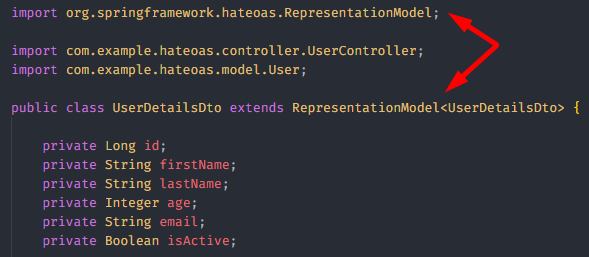
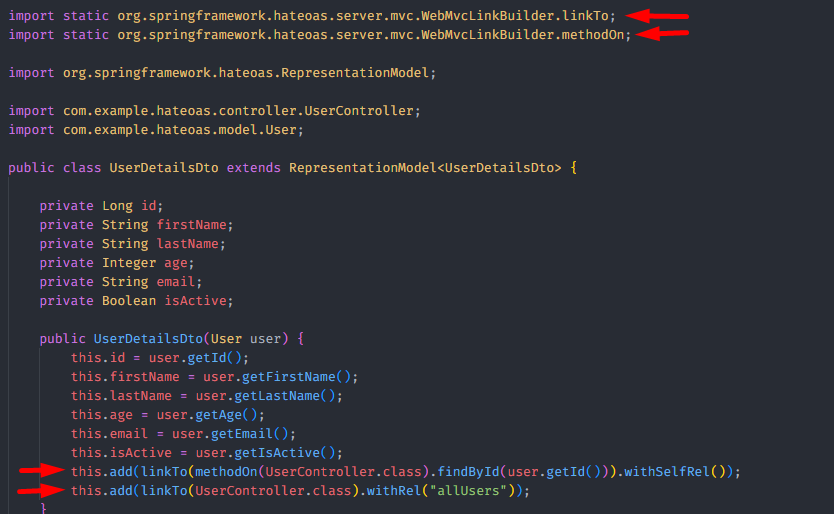
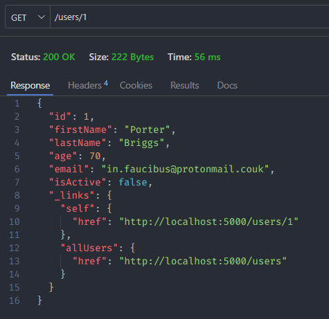

<h1 align="center"><strong>HATEOAS</strong></h1>


<p>Explaining what HATEOAS is in a simple way, it is the API's ability to inform the user of additional functionalities related to the responded content of the request.</p>

&nbsp;

<h3><b>Example</b></h3>

<p>Let's assume that the user makes a request to consult a person's data, and receives the following response:</p>

```
{
  "id": 1,
  "name": "John Doe",
}
```

<p>In this example, HATEOAS is not being used. The API returns a simple JSON containing the ID and name of the person queried.</p>

<p>In the next example, the API is using HATEOAS, and along with the person's data, it returns a "links" field.</p>

```
{
  "id": 1,
  "name": "John Doe",
  "links": [
	{
	  "rel": "self",
	  "href": "http://localhost/users/1"
	},
	{
	  "rel": "allUsers",
	  "href": "http://localhost/users"
  ]
}
```

<p>The first link is "self", which describes the URL of the request itself.</p>

```
{
  "rel": "self",
  "href": "http://localhost/users/1"
}
```

<p>The second is the "allUsers" link, which describes the URL of another endpoint that allows the user to query information about all people registered in the API.</p>

```
{
  "rel": "allUsers",
  "href": "http://localhost/users"
}
```

&nbsp;

<h3><b>Implementation</b></h3>

<p></p>

<p>There are different ways to implement HATEOAS in your API. The method I chose was to implement it in the Data Transfer Object (DTO) used in responding to requests.</p>

<p>First it is necessary to extend the <b>RepresentationModel</b> class from the <i>org.springframework.hateoas</i> package.</p>

<div align="center">
	
</div>

<p>Then add the code with the "links" field and the desired tags inside the DTO class constructor.</p>

<div align="center">
	
</div>

<p>With these settings, each user will have the "self" and "allUsers" link in the response json.</p>

<div align="center">
	
</div>
