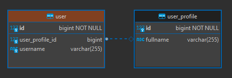

<h1 align="center"><strong>JPA with MySQL</strong></h1>

This is an example of a Java Spring Boot API using JPA and MySQL database. Here the most used types of mappings between entities and queries were exemplified. A few points of attention will be discussed about the most used mappings below.

&nbsp;

## **How to run**

1. Run the docker-compose.yml to initialize the database
1. Run the Spring Boot project

### Dependencies:
- Docker
- Docker compose
- Java JDK 17
- Maven 3.9.3+

### Flyway

This project supports Flyway migrations. The SQL scripts are in the *src/main/resources/db/migration* folder.

If you want to disable migrations to speed up experimentation with different mappings, follow the steps below: 

1. Delete the database if it was created previously
1. Comment the flyway dependency in pom.xml
1. Change the value of the 'hibernate.ddl-auto' property to 'update' in application.yml

&nbsp;

## **Mapping annotations**

The most used JPA mappings are:

- @OneToOne
- @OneToMany
- @ManyToOne
- @ManyToMany

This is because these mappings generally resolve almost all situations. However, there are other types of mappings such as:

- @ElementCollection
- @Embedded
- @Embeddable
- @MapKey
- @OrderBy
- @OrderColumn

In this project, only the most used mappings were used.

&nbsp;

## **@OneToOne**

This annotation establishes a one-to-one relationship between two entities. It means that one instance of an entity is associated with exactly one instance of another entity. 

<div align="center">
	
</div>

There are different ways to perform OneToOne mapping:

```
@Entity
@Table(name = "user")
public class User {
    
	@Id
    private Long id;
	@OneToOne
    private UserProfile userProfile;
}

@Entity
@Table(name = "user_profile")
public class UserProfile {
    
	@Id
    private Long id;
	private String fullName;
}
```

In this case, @OneToOne establishes a unidirectional one-to-one relationship between User and UserProfile. This means that User entity has a reference to UserProfile, but UserProfile entity doesn't have any reference back to User. In the database, this would typically be represented by a foreign key in the User table referencing the primary key of the UserProfile table.

### mappedBy

```
@Entity
@Table(name = "user")
public class User {
    @Id
    private Long id;
    private String username;
    @OneToOne(mappedBy = "user")
    private UserProfile userProfile;
}

@Entity
@Table(name = "user_profile")
public class UserProfile {
    @Id
    private Long id;
    private String fullName;
    @OneToOne
    private User user;
}
```

Here, mappedBy attribute is used in User entity to indicate that the owning side of the relationship is UserProfile, and it's mapped by the user attribute in UserProfile. This implies that UserProfile entity maintains the foreign key relationship in the database, referencing the primary key of the User table.

### @JoinColumn

```
@Entity
@Table(name = "user")
public class User {
    @Id
    private Long id;
    private String username;
    @OneToOne
    @JoinColumn(name = "user_profile_id")
    private UserProfile userProfile;
}

@Entity
@Table(name = "user_profile")
public class UserProfile {
    
	@Id
    private Long id;
	private String fullName;
}
```

In this case, @JoinColumn annotation is used along with @OneToOne to specify the column in the User table that will be used to store the foreign key referencing the UserProfile. This provides more control over the column name and other properties of the foreign key column.

### Summary

- Use simple @OneToOne when you only need a unidirectional relationship where one entity references another.
- Use mappedBy when you need bidirectional mapping, and the other entity is responsible for managing the relationship.
- Use @JoinColumn when you need more control over the column name and properties of the foreign key column in the owning entity's table.

&nbsp;

## **@OneToMany**

This annotation establishes a one-to-many relationship between two entities. It means that one instance of an entity is associated with multiple instances of another entity.

<div align="center">
	
</div>

```
@Entity
@Table(name = "post")
public class Post {
    
	@Id
    private Long id;
    private String title;
    @OneToMany(mappedBy = "post")
    private List<Comment> comments;
}

@Entity
@Table(name = "comment")
public class Comment {
    
	@Id
    private Long id;
    private String text;
    @ManyToOne
    private Post post;
}
```
