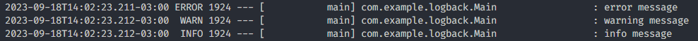
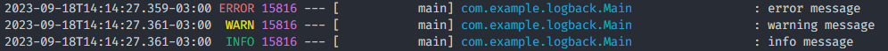
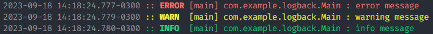
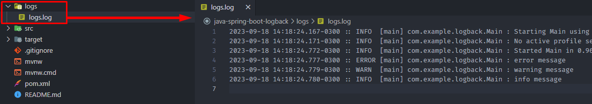
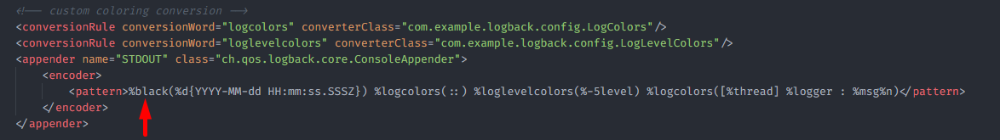
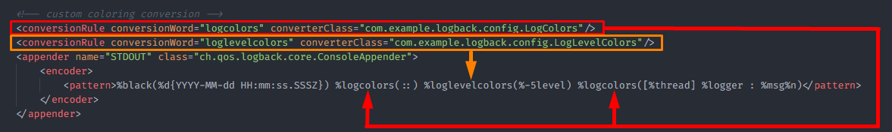

<h1 align="center"><strong>Logback</strong></h1>

This project has a simple Logback configuration implementation. A customization of logback.xml was applied so that the logs in the console are displayed with styling, and a .log file is generated in the project root.

&nbsp;

### **Default configuration**

This is an example of what the console logs look like when there is no configuration applied:

<div align="center">
	
</div>

&nbsp;

### **ANSI enabled**

This is an example of what console logs look like when *output.ansi.enabled* is set to **always** in the project's application.properties:

```
spring.output.ansi.enabled=always
```

<div align="center">
	
</div>

&nbsp;

### **Custom logback.xml**

This is an example of how console logs are displayed using a custom logback.xml and the *output.ansi.enabled=always* setting in application.properties:

<div align="center">
	
</div>

&nbsp;

A .log file is generated with all the logs generated by the application.

<div align="center">
	
</div>

&nbsp;

It is possible to define the color of the logs directly in the logback.xml file.

<div align="center">
	
</div>

&nbsp;

To perform a more complex configuration, such as changing the font weight along with the color, it is possible to do so using Java code.

<div align="center">
	
</div>

&nbsp;

## **Dependencies**

- Java JDK 17
- Maven 3.9.3+