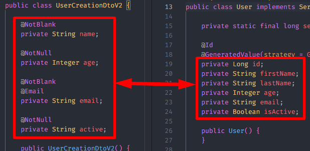

<h1 align="center"><strong>ModelMapper</strong></h1>

This is an example of an API using [ModelMapper](https://modelmapper.org). There are several other tools for mapping objects, ModelMapper is one of the most popular due to its simplicity of use. Below will be detailed how it was implemented in this API.

*Note: until this moment, ModelMapper does not work with Records from Java 17. It works with conventional java classes, optionally with lombok.*

&nbsp;

## **Initial Configuration**

First you need to create the @Bean with the ModelMapper configuration.
Add the modelmapper dependency in the pom.xml.

```xml
<dependency>
  <groupId>org.modelmapper</groupId>
  <artifactId>modelmapper</artifactId>
  <version>3.2.0</version> <!-- latest version -->
</dependency>
```

Create a the initial Configuration class.

```java
@Configuration
public class ModelMapperConfig {
  @Bean
  ModelMapper modelMapper() {
    return new ModelMapper();
  }
}
```

&nbsp;

## **Direct Mapping**

Using the initial configuration above, it's already possible to use modelmapper. Take a look at the example below:

```java
UserDetailsDto dto = mapper.map(User.class, UserDetailsDto.class);
```

The User.class is the source object, and the UserDetailsDto.class is the destination object. If the conversion is successful, it will create a UserDetailsDto object with the User class informations.

This direct mapping is possible when the objects have the same structure.

<div align="center">
	
</div>

&nbsp;

## **Custom Mapping**

Sometimes the source and destination objects have different structures, and for this it is necessary to create a customized mapping. There are several ways to do this, the way I chose was to use Converters.

In this first example, I want to convert the UserCreationDtoV1 object to a User object. Since they have the same structure, it's possible to use a direct mapping.

<div align="center">
	
</div>

Now on the second example, I want to convert the UserCreationDtoV2 object to a User object, but they have different structures.

<div align="center">
	
</div>

There are three points of attention

- The ID attribute is not present in UserCreation toV2. I chose to resolve this in the UserService class, so it will not be the Modelmapper's responsibility.
- The "name" attribute on UserCreationDtoV2 must be divided into two parts and stored in the "firstName" and "lastName" attributes of the User object.
- The "active" attribute on UserCreationDtoV2 needs to be converted from String to Boolean, and be stored on the "isActive" attribute of the User object.

At run time, ModelMapper will try to map the two objects, but it will not be done correctly, as ModelMapper does not yet know how to resolve the incompatibilities between these two objects. Therefore, let's create a custom converter, showing ModelMapper how the mapping of these two objects should be carried out when requested.

First, let's create a class where all the converters in our API will be stored, in this case it will only be one.

<div align="center">
	
</div>

The converter has been created but is not yet used. It is necessary to modify the ModelMapper configuration class to read and use all converters created here.

<div align="center">
	
</div>

From now on, every time a conversion from UserCreationDtoV2 to User is performed, it will check if there is a custom converter and will use it if it exists.

&nbsp;

## **Dependencies**

- Java JDK 17
- Maven 3.9.3+