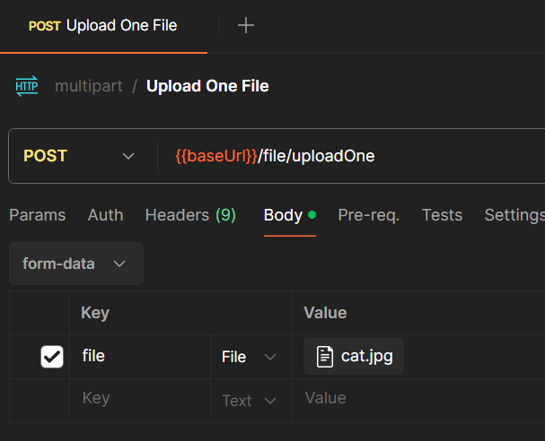
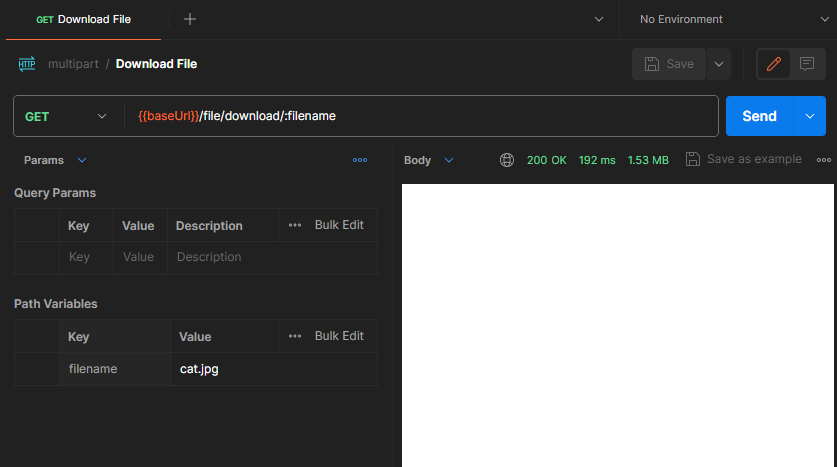
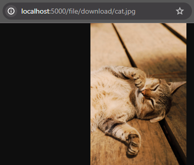

<h1 align="center"><strong>Multipart</strong></h1>

This is an example of an API with the ability to transfer multimedia files via the HTTP protocol using the Multipart implementation. 

The implementation of this project is relatively simple, so just a few points of attention will be detailed below.

&nbsp;

## **How to run and test**

There are no peculiarities to this project. So, just clone the repository and run the project normally.

Dependencies:
- Java JDK 17
- Apache Maven 3.9.3+

Within the project, in the resources folder, a postman collection is available to make HTTP requests, and some multimedia files to test with the requests.

Before executing upload requests, check that the request has a body of the form-data type, a "file" key with the File type, and a file from your local machine has been selected in the value field. Illustrative image below:

<div align="center">
	
</div>

&nbsp;

## **application.properties**

There are some important properties for using Multipart.

- **spring.servlet.multipart.file-size-threshold**: Threshold after which files are written to disk
- **spring.servlet.multipart.max-file-size**: Max file size
- **spring.servlet.multipart.max-request-size**: spring.servlet.multipart.max-request-size
- **file.upload.directory**: Custom property to define where files should be saved on the local machine. This directory is defined from the system root folder

&nbsp;

## **File download/upload validations**

There are a few recommended places to add custom validations for file downloads and uploads.

### Controller URI

In the endpoint to download a file (GET /file/download), after the default URI value, the value "/{filename:.+}" was added. 

This was done to define that the api will expect the request parameter to be provided in this format: /filename.extension.

Example: /cat.jpg

### Before file storage

The storeFile method of the MultipartUtils class is responsible for storing files. Before the actions to define the storage location, and the storage action itself, there is a suggested location to add custom validations.

```java
public String storeFile(MultipartFile file) {
		
	String fileName = StringUtils.cleanPath(file.getOriginalFilename());

	if(Strings.isBlank(fileName)) {
		throw new NullFileUploadException(ErrorMessages.NULL_FILE_UPLOAD);
	}

	// add custom validation HERE !!

	Path targetDirectory = fileStorageDirectory.resolve(fileName);
```

Validations can be varied such as:
- Invalid filename format
- Block certain types of files (audio, video, ...)

&nbsp;

## **Content Disposition response**

When downloading files via HTTP, it is possible to customize the way in which the content will be made available to the user. To do this, it is possible to define values for the Content-Disposition header of the HTTP response.

There are two most common types:
- attachment
- inline

### Inline

This is the default type if no other is defined. This way, the content will be displayed in the browser.

### Attachment

Using this type, the content will be made available as a file download to the user's machine.

Generally, using the "attachment" type, the server will search for the file in the repository and will make it available to the user with the original file name. You can change the file name before making it available to the customer using the following format: attachment; filename="customFileName.jpg".

By default, this project is configured to use 'inline' Content-Disposition. This can be customized in the resolveDownloadFileContentDisposition method of the FileService class.

&nbsp;

## **Remote file storage**

It was not implemented in this project, but it is possible to define a remote location to store the files received via upload. This can be configured in the storeFile method, of the MultipartUtils class, responsible for carrying out the storage.

```java
public String storeFile(MultipartFile file) {
	
	// storage location. could be local or remote
	Path targetDirectory = fileStorageDirectory.resolve(fileName);
```

&nbsp;

## **Known issues**

### Problems with download response

In some cases, depending on how the download request is made, there may be problems viewing the response. In my case, I used Postman via browser, and the response when downloading an image was a white screen.

<div align="center">
	
</div>

However, when making the request via the web browser, the image was displayed correctly.

<div align="center">
	
</div>

Using the Postman Desktop App also worked correctly. Therefore, there must be a problem with Postman via the web browser.

### File download via Postman

Even changing the Content-Disposition of the response to "attachment", the file download to the local machine will not happen if the request is made via Postman. In this case, it is necessary to make the request via the web browser.