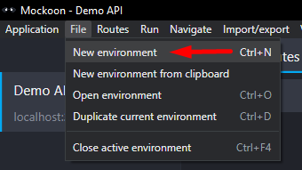
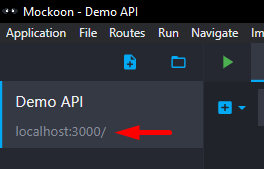
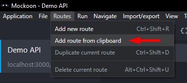
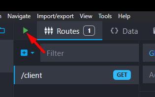

<h1 align="center"><b>OpenFeign</b></h1>

This is an example of a Java Spring Boot API that implements the OpenFeign interface, which makes it easy to make HTTP requests with little configuration. Below will be detailed how to run and test the application, and some points of attention.

## How to run

For this project, the Mockoon tool was used to return mocked API responses. However, you are free to use any mock tool.

1. Import the Postman collection from the *resources/postman* folder
1. Setup a Mock tool to handle the API responses.
	1. Download [Mockoon](https://mockoon.com/)
	1. Create a new Environment using the localhost:3000 port
		<div align="center"></div>
		<div align="center"></div>
	1. Copy the route configuration JSON from the *resources/mockoon* folder and use it the create a new route
		<div align="center"></div>
	1. Click on the created route and start the server
		<div align="center"></div>
	1. All done. The tool is ready the receive requests.
1. Start the Java Spring Boot API
1. Test the API requests using the Postman collection

### Dependencies

- Java JDK 17
- Maven 3.9.3+

&nbsp;

## FeignException

OpenFeign considers all HTTP responses with codes within the 4xx and 5xx ranges as an exception. This allows any FeignException handled in a custom way by the RestControllerAdvice. In this case, I configured it so that RestControllerAdvice resolves any FeignException dynamically.

```
@ExceptionHandler(FeignException.class)
public ResponseEntity<?> handleFeignException(FeignException e) {

	HttpStatus status = HttpStatus.valueOf(e.status());

	if(status == null) {
		status = HttpStatus.INTERNAL_SERVER_ERROR;
	}

	return ResponseEntity
		.status(status)
		.body(new GenericResponseDTO(feignUtils.extractErrorMessage(e)))
	;
}
```

&nbsp;

## Custom configuration

It is possible to define custom settings for OpenFeign. In this case, I defined a configuration so that the application shows the logs of requests and responses from a FeignClient.

### application config

It is necessary to define the application.properties (or application.yml) so that the application captures FeignClients logs at the DEBUG level. It is possible to define specific FeignClients, or define the package where the FeignClients are. In this case, I defined the package name.

```
logging:
  level:
    '[com.example.openfeign.integration]': DEBUG
```

### FeignConfig

Create a configuration class for Feign. In it, a Bean will be created that will define the desired log type. In my case, I just want to view the request URL and the response code, so I set it to BASIC.

```
@Configuration
public class FeignConfig {
	@Bean
    Logger.Level feignLoggerLevel() {
        return Logger.Level.BASIC;
    }
}
```

### Add custom config to FeignClient

The last step is to add the custom configuration to the desired FeignClient.

```
@FeignClient(name..., url..., configuration = FeignConfig.class)
public interface ExampleClient {
}
```

Now, requests and responses from the configured FeignClient will be logged in the application console.

```
[ExampleClient#getResponse] ---> GET http://localhost:3000/client?status=200 HTTP/1.1
[ExampleClient#getResponse] <--- HTTP/1.1 200 OK (41ms)
```