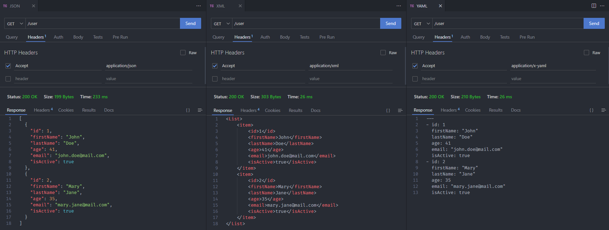

<h1 align="center"><strong>Content negotiation</strong></h1>

This project is an example of the implementation of Content Negotiation, that is, the API's ability to return data in different formats. In this case, the API was configured to return in JSON, XML and YAML formats.

&nbsp;

	

