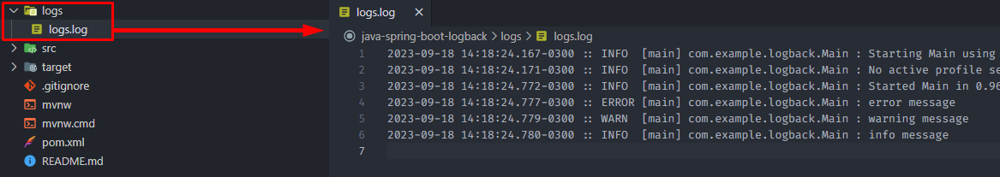

<h1 align="center"><strong>Spring Boot - Logback</strong></h1>

<p>This project has a simple Logback configuration implementation. A customization of logback.xml was applied so that the logs in the console are displayed with styling, and a .log file is generated in the project root.</p>

&nbsp;

<h3><strong>Default configuration</strong></h3>

<p>This is an example of what the console logs look like when there is no configuration applied:</p>

<div align="center">
	
</div>

&nbsp;

<h3><strong>ANSI enabled</strong></h3>

<p>This is an example of what console logs look like when <i>output.ansi.enabled</i> is set to <strong>always</strong> in the project's application.properties:</p>

```
spring.output.ansi.enabled=always
```

<div align="center">
	
</div>

&nbsp;

<h3><strong>Custom logback.xml</strong></h3>

<p>This is an example of how console logs are displayed using a custom logback.xml and the <i>output.ansi.enabled=always</i> setting in application.properties:</p>

<div align="center">
	
</div>

&nbsp;

<p>A .log file is generated with all the logs generated by the application.</p>

<div align="center">
	
</div>

&nbsp;

<p>It is possible to define the color of the logs directly in the logback.xml file.</p>

<div align="center">
	
</div>

&nbsp;

<p>To perform a more complex configuration, such as changing the font weight along with the color, it is possible to do so using Java code.</p>

<div align="center">
	
</div>
