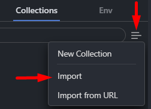

<h1 align="center"><strong>Collection for HTTP requests</strong></h1>

This directory has the .json collection of HTTP requests to be used in this project. This collection was created and tested using the <a href="https://marketplace.visualstudio.com/items?itemName=rangav.vscode-thunder-client" target="_blank" rel="noopener noreferrer">Thunderclient</a> extension within the <a href="https://code.visualstudio.com/" target="_blank" rel="noopener noreferrer">VSCode</a> editor.

&nbsp;

	

