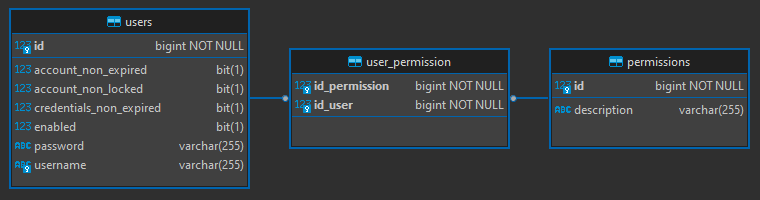

<h1 align="center"><strong>Spring Security</strong></h1>

This is an example of an API using [Spring Security](https://spring.io/projects/spring-security). This is the standard security module for APIs developed with Spring, offering highly customizable access control and authentication solutions. 

For this project, the focus was on applying access control and authentication to a Java Spring Boot REST API. As it is a REST API, it is implicit that the authentication method is STATELESS.

Below is a general implementation guide:

1. Add Spring Security and JWT libraries to the project's pom.xml
2. Create a database for storing users and access permissions
3. Create User and Permission model classes
4. Insert a least one user and one permission on the database
5. Implement the a security Filter and a security Configuration
6. All done! Ready to deploy 😎

**This README is not intended to explain a detailed step-by-step guide on how to implement Spring Security. Some important topics to pay attention to during implementation will be highlighted below.**

&nbsp;

<h2><strong>pom.xml</strong></h2>

This project will use several libraries. However, the libraries that will be essential for implementing Spring Security are:

- **spring-boot-starter-security** from org.springframework.boot: access control and authentication modules
- **java-jwt** from [com.auth0](https://github.com/auth0/java-jwt): popular library for generating tokens

Make sure to have them in your pom.xml

```
<dependency>
    <groupId>org.springframework.boot</groupId>
    <artifactId>spring-boot-starter-security</artifactId>
</dependency>
<dependency>
    <groupId>com.auth0</groupId>
    <artifactId>java-jwt</artifactId>
    <version>!!insert the latest version here!!</version>
</dependency>
```

&nbsp;

<h2><strong>Database</strong></h2>

You will need a database for storing the users and permissions. Choose any of your choice. 

For convenience, I already provided a docker-compose with a MySQL database, the same I used in the project. If you already have a database in your API, then create the tables and insert the initial values.

This project has FlyAway migrations support. The scripts for creating the tables and inserts are already in the project.

Below is the minimum structure for Spring Security to work correctly.

<div align="center">
	
</div>

&nbsp;

<h2><strong>User and Permission classes</strong></h2>

Now we need to implement the User and Permission classes, following the same data structure of the sql scripts.

Both classes will use JPA for database integration. Both will need an ID column, and a empty constructor.

Since we are implementing Spring Security, these two classes will be used for access control.

### Permission

The Permission class will represent the permissions types. Spring Security requires this class to implement GrantedAuthority.

```
public class Permission implements GrantedAuthority
```

### User

The User class will represent the application's users. Spring Security requires this class to implement UserDetails.

```
public class User implements UserDetails
```

Spring Security requires the existence of some attributes in the user to perform access control.

```
private String username;
private String password;
private Boolean accountNonExpired;
private Boolean accountNonLocked;
private Boolean credentialsNonExpired;
private Boolean enabled;
private List<Permission> permissions;
```

The name of these attributes is considered a Spring convention, so it is recommended to use exactly these names.

It is necessary to map an intermediate table in the database to link users and permissions. Since this is a simple project, I chose to carry out this mapping within User as it is the strongest entity.

```
@ManyToMany(fetch = FetchType.EAGER)
@JoinTable(
	name = "user_permission", 
	joinColumns = {
		@JoinColumn(name = "id_user")
	},
	inverseJoinColumns = {
		@JoinColumn(name = "id_permission")
	})
private List<Permission> permissions;
```

&nbsp;

<h2><strong>Insert initial User and Permission</strong></h2>

For initial use of the API, it is suggested to register at least one user and one permission in the database.

The project already has a SQL migration to insert this initial data. Note that the User in the script has the username "admin.user" and an encrypted password that represents the value "admin123".

If you need to generate a new password, use the EncodeUtils class.

&nbsp;

<h2><strong>Security Filter</strong></h2>

To facilitate understanding, we can consider that the Security Filter is the gateway to the API. All requests will go through there, functioning as Middleware. After passing through the Security Filter, the request will be forwarded to the Security Configuration, where it will be forwarded to the endpoints defined there.

TODO insert diagram image

&nbsp;

- TODO UserDetailsServices
- TODO Security Layer vs Controller Layer
- TODO Custom Authentication Handlers
- TODO UsernameNotFoundException
- TODO DateUtils
- TODO JWT structure and expiration time