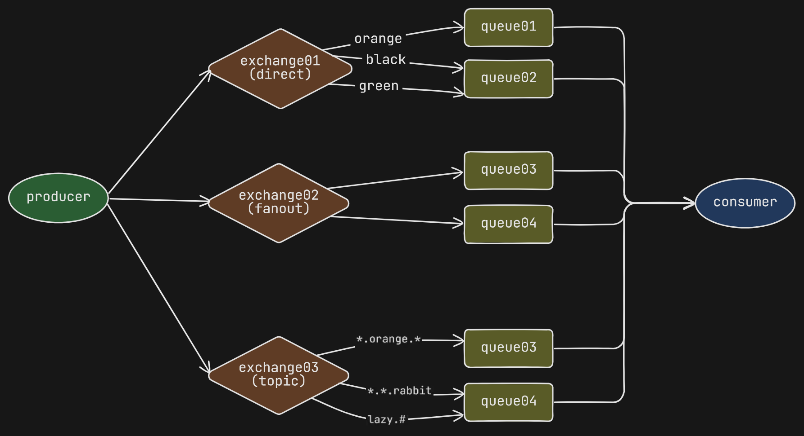

<h1 align="center"><strong>RabbitMQ</strong></h1>

This project is an example of a Java Spring Boot API using RabbitMQ messaging. Using RabbitMQ in conjunction with RabbitMQ has a considerably abstracted implementation. The AMQP library, responsible for making the connection between Spring Boot and RabbitMQ, by default already has several settings defined to make life easier.

This project has a simple implementation of the 3 main types of exchange:

- Direct
- Fanout
- Topic

The names of exchanges, queues and routing keys are defined in application.yml. The settings are all present in RabbitMQConfig.java. The drawing below illustrates this configuration:

	

To learn more, see the official [RabbitMQ documentation for Spring](https://www.rabbitmq.com/tutorials/tutorial-one-spring-amqp).

## **How to run**

1. Run the docker-compose.yml. This will start a container with RabbitMQ.
1. Run the java project
1. Use the postman collection to test the API

## **Dependencies**

- Docker
- Docker compose
- Java JDK 17
- Maven 3.9.3+