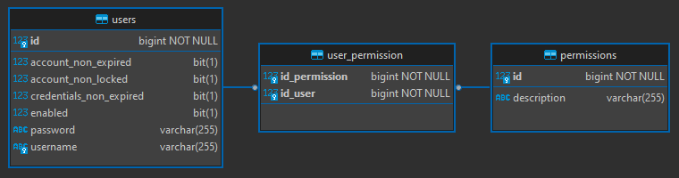
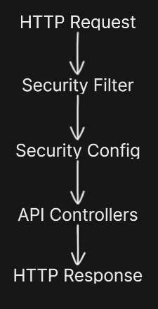
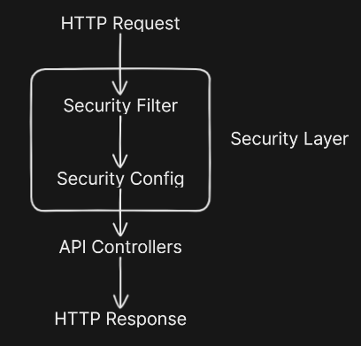

<h1 align="center"><strong>Spring Security</strong></h1>

This is an example of an API using [Spring Security](https://spring.io/projects/spring-security). This is the standard security module for APIs developed with Spring, offering highly customizable access control and authentication solutions. 

For this project, the focus was on applying access control and authentication to a Java Spring Boot REST API. As it is a REST API, it is implicit that the authentication method is STATELESS.

Below is a general implementation guide:

1. Add Spring Security and JWT libraries to the project's pom.xml
2. Create a database for storing users and access permissions
3. Create User and Permission model classes
4. Insert a least one user and one permission on the database
5. Implement the a security Filter and a security Configuration
6. All done! 😎🥂

**This README is not intended to explain a detailed step-by-step guide on how to implement Spring Security. Some important topics to pay attention to during implementation will be highlighted below.**

&nbsp;

## **pom.xml**

This project will use several libraries. However, the libraries that will be essential for implementing Spring Security are:

- **spring-boot-starter-security** from org.springframework.boot: access control and authentication modules
- [**java-jwt** from com.auth0](https://github.com/auth0/java-jwt): popular library for generating tokens

Make sure to have them in your pom.xml

```
<dependency>
    <groupId>org.springframework.boot</groupId>
    <artifactId>spring-boot-starter-security</artifactId>
</dependency>
<dependency>
    <groupId>com.auth0</groupId>
    <artifactId>java-jwt</artifactId>
    <version>!!insert the latest version here!!</version>
</dependency>
```

&nbsp;

## **Database**

You will need a database for storing the users and permissions. Choose any of your choice. 

For convenience, I already provided a docker-compose with a MySQL database, the same I used in the project. If you already have a database in your API, then create the tables and insert the initial values.

This project has FlyAway migrations support. The scripts for creating the tables and inserts are already in the project.

Below is the minimum structure for Spring Security to work correctly.

<div align="center">
	
</div>

&nbsp;

## **User and Permission classes**

Now we need to implement the User and Permission classes, following the same data structure of the sql scripts.

Both classes will use JPA for database integration. Both will need an ID column, and a empty constructor.

Since we are implementing Spring Security, these two classes will be used for access control.

### Permission

The Permission class will represent the permissions types. Spring Security requires this class to implement GrantedAuthority.

```
public class Permission implements GrantedAuthority
```

### User

The User class will represent the application's users. Spring Security requires this class to implement UserDetails.

```
public class User implements UserDetails
```

Spring Security requires the existence of some attributes in the user to perform access control.

```
private String username;
private String password;
private Boolean accountNonExpired;
private Boolean accountNonLocked;
private Boolean credentialsNonExpired;
private Boolean enabled;
private List<Permission> permissions;
```

The name of these attributes is considered a Spring convention, so it is recommended to use exactly these names.

It is necessary to map an intermediate table in the database to link users and permissions. Since this is a simple project, I chose to carry out this mapping within User as it is the strongest entity.

```
@ManyToMany(fetch = FetchType.EAGER)
@JoinTable(
	name = "user_permission", 
	joinColumns = {
		@JoinColumn(name = "id_user")
	},
	inverseJoinColumns = {
		@JoinColumn(name = "id_permission")
	})
private List<Permission> permissions;
```

&nbsp;

## **Insert initial User and Permission**

For initial use of the API, it is suggested to register at least one user and one permission in the database.

The project already has a SQL migration to insert this initial data. Note that the User in the script has the username "admin.user" and an encrypted password that represents the value "admin123".

If you need to generate a new password, use the EncodeUtils class.

&nbsp;

## **Security Filter**

To facilitate understanding, we can consider that the Security Filter is the gateway to the API. All requests will go through there, functioning as Middleware. After passing through the Security Filter, the request will be forwarded to the Security Configuration, where it will be forwarded to the endpoints defined there.

<div align="center">
	
</div>

The fundamental function of the Filter is to define whether or not the user responsible for the Request should be considered as an authenticated user. Once this information is defined, Security Config will be able to know which endpoints this user has access to.

&nbsp;

## **UserDetailsService**

Spring Security requires you to implement the UserDetailsService interface. To do this, I implemented this in the UserDetailsServices class (Services with S at the end, so as not to repeat the name of the UserDetailsService interface).

In the implementation class, it is necessary to override the loadUserByUsername method, informing how the user's username should be searched for in the database.

Note that this class is not directly used anywhere in the project. In fact, it is Spring Security that uses this implementation under the hood.

By default, when overriding the loadUserByUsername method, Java automatically creates the method informing that it throws a UsernameNotFoundException exception

```
public UserDetails loadUserByUsername(String username) throws UsernameNotFoundException
```

At the time of creating this project, using version 3.2.2 of Spring Boot and Java 17, it appears that this exception is not thrown when the user search returns a null value. To get around this issue, I chose to implement it in a way that the execution is launched in case of null return.

```
return userRepository.findByUsername(username).orElseThrow(
	() -> new UsernameNotFoundException("error message")
);
```

&nbsp;

## **Secruity Layer - Exception Handling**

The Security Filter and Security Config belong to the Spring Security layer, and the API Controllers are not within it. Therefore, exceptions that happen in the Security layer cannot be handled by Controller Advice.

<div align="center">
	
</div>

By default, Spring Security resolves most situations by responding with HTTP status 403. Situations such as incomplete request, expired JWT, non-existent routes, among others.

If you want to handle these exceptions in a customized way, Spring provides some interfaces to make this possible. The interfaces that I found most useful are:

### AuthenticationEntryPoint

Responsible for most cases, such as:
- Requests for non-existing routes
- Requests for existing routes but with unimplemented HTTP verbs
- Empty body requests on body required endpoints
- Invalid or expired JWT

### AccessDeniedHandler

Related to access level. Occurs when the user makes a valid request, but does not have the necessary level of permission to access the endpoint.

### AuthenticationFailureHandler and AuthenticationSuccessHandler

These two are related to the **stateful authentication** process. They are responsible for defining how the API should act if user authentication is successful or unsuccessful.

### Configuration

To use these interfaces, you must first implement them. I developed implementation examples inside the security/handlers folder.

After creating the implementation, it is necessary to add the Beans to the Security Config class, and configure the securityFilterChain method. I left this configuration commented in the Security Config class.

&nbsp;

## **Jackson date issue**

When constructing the request response, the jackson library converts a java object to a json. Unfortunately, sometimes in this process, Jackson gets messed up to do the correct date conversion. Sometimes the date is created with a different time zone than the current system. To work around this problem, it is recommended that the date be created as a String, and added to the object before jackson converts it to json. The formatDate method of the DateUtils class does just that.

&nbsp;

## **How to run the project**

Finalmente, mas não menos importante, para executar e testar o projeto é bem simples:

1. Run the docker-compose.yml
2. Run the Spring Boot API
3. Use the Postman collection to test the endpoints