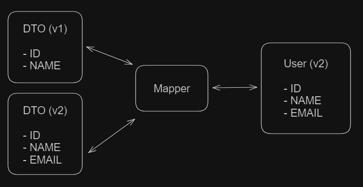

<h1 align="center"><strong>Versioning</strong></h1>

This is an example of a Java Spring Boot API that implements versioning of endpoints and DTOs. Versioning a Spring Boot API is essential to ensure backward compatibility and facilitate smooth transitions when making updates or introducing new features.

&nbsp;

## **Best strategy?**

There is no perfect strategy, it depends on each project and its needs. In the case of this project, which uses the MVC (Model, View. Control) pattern, there are some artifacts that are recommended to be versioned.

### Endpoints

We can version Controllers, where a version is created each time new endpoints are created. Another strategy is to version only the endpoints, and keep them all on the same Controller, which is the case in this project.

### DTOs

DTOs (Data Access Object) are immutable objects that allow you to transport data consistently between different layers of the application. When versioning DTOs, the goal is to ensure that changes in one version do not affect others.

&nbsp;

## **Mappers vs DTOs**

An interesting strategy when versioning DTOs is to use Mappers to transport data between them in a consistent manner.

Imagine the following scenario: Let's say the User model class has been updated. In its first version, it had ID and NAME fields. Now it has ID, NAME and EMAIL fields. The model class can receive updates at any time, however it may happen that API users are still using the previous version, consequently using the previous version of the User class.

To do this, we can create a DTO for each version of the User class. And the conversion from DTO to User class can be solved by a Mapper.

<div align="center">
	
</div>

There are several options for using Mappers. Some popular projects like ModelMapper, MapStruct, or implement your own mapper using pure java, which was the case with this project.

```
public Page<UserDetailsDtoV1> findAllV1(Pageable pagination) {
  Page<User> users = userRepository.findAll(pagination);
  return users.map(userMapper::toUserDetailsDtoV1);
}
```

And just for demonstration, below is an example of what the same code would look like, but using ModelMapper.

```
public Page<UserDetailsDtoV1> findAllV1(Pageable pagination) {
  Page<User> users = userRepository.findAll(pagination);
  return users.map(user -> modelMapper.map(user, UserDetailsDtoV1.class));
}
```

&nbsp;

## **How to run**

1. Run the Spring Boot project
1. Use the postman collection on the *resources/postman* folder to test the API

&nbsp;

## **Dependencies**

- Java JDK 17
- Maven 3.9.3+